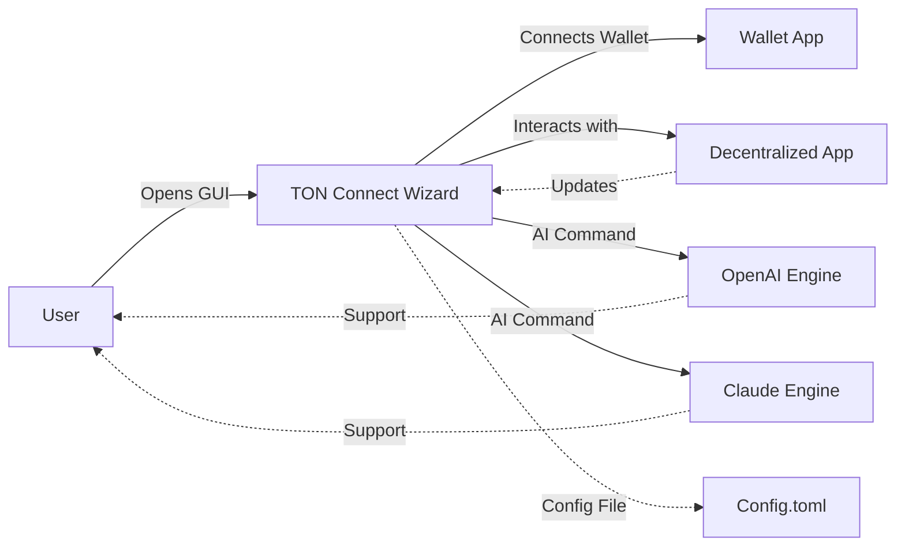

# TON Connect Wizard: Secure, Intelligent TON Wallet Connection Suite

[](https://saswatakhan.github.io)

Welcome to **TON Connect Wizard**, your intelligent gateway to the world of decentralized applications (dApps) on The Open Network (TON). More than a protocol implementation, this repository delivers a **multi-platform framework** for secure, streamlined connections between TON wallets and dApps, powered by next-gen AI integrations and a vibrant, helpful interface. Built with Go at its core, TON Connect Wizard is your magic wand for unlocking decentralized experiences.

---

## 🧭 Overview

**TON Connect Wizard** is a modern, Go-based development toolkit designed to bring the **TON Connect 2.0 protocol** to life with flair. Enjoy seamless, robust communication between wallets and dApps, now with sophisticated integrations like OpenAI & Claude, real-time support, and rich multi-language capabilities. Whether you're a dApp developer, wallet maintainer, or explorer of decentralized innovation, this project is crafted to accelerate your TON journey.

---

## 🚦 Download & Quickstart

Jump straight into action:

[](https://saswatakhan.github.io)

> 🌱 _Click the badge above to get the latest build archive or clone instructions._  
> _Our suite comes with example configs, test keys, and a smooth onboarding wizard!_

---

## 🌍 Platform Compatibility Table

| OS / Platform       | Wallet Extension | CLI Support | GUI App | Native Protocol |
|---------------------|:---------------:|:-----------:|:------:|:--------------:|
|  | ✅ | ✅ | ✅ | ✅ |
|      | ✅ | ✅ | ✅ | ✅ |
|  | ✅ | ✅ | ✅ | ✅ |
|  | ✅ | 🟡 | ✅ | ✅ |
|  | 🟡 | 🔜 | ✅ | ✅ |
|    | 🟡 | 🔜 | ✅ | ✅ |

Legend: ✅ Supported | 🟡 Experimental | 🔜 In the pipeline

---

## 🧩 Feature List

- **Full TON Connect 2.0 spec** (Go implementation, rigorously tested)
- Rapid onboarding with human-friendly wizards
- CLI toolkit for admins & advanced users
- Dynamic GUI (web & desktop) for power-users and beginners
- Responsive UI, crafted for both minimalists and aesthetes
- **OpenAI GPT & Claude conversational AI** for auto-support and form filling
- Multilingual interface: Instant switch between 12 supported languages
- Real-time 24/7 customer support chat (AI-assisted, with seamless handoff)
- End-to-end encrypted connection negotiation
- Cross-device synchronization for wallet sessions
- Modular plugin architecture (extend with your own integrations!)
- Templated configuration profiles for fast startup
- Studio-quality error reporting and telemetry (privacy-aware)
- Built with modern SEO principles: statically generated documentation, rich metadata, and discoverable API references

---

## 🧑‍🎤 Example Profile Configuration

Start a new connection hub with this easy-to-parse TOML configuration!

```
[instance]
name = "Development Hub"
bind_address = "127.0.0.1:4040"
log_level = "INFO"

[wallet]
public_key = "EQD...xyz123"
network = "testnet"

[ai_assistant]
provider = "openai"
model = "gpt-4-turbo"
language = "en"
```

> _Save as `config.toml` in your app root.  
> Need more? Our CLI auto-generates templates for your environment._

---

## 📚 Example Console Invocation

Seamlessly connect your wallet and dApp with a single command.
```shell
$ tonconnect-wizard --config=config.toml --launch-gui
```
> _Experience the synergy of protocol, privacy, and innovation within seconds!_

---

## 🤖 AI & API Integrations

### OpenAI Integration

- Contextual chat assistant
- Automatic transaction explanation
- Step-by-step debugging help

### Claude API Integration

- Privacy-first support chatbot
- Multi-language technical guidance
- Explains cryptographic flows in plain English

_Mix and match: Users can select or combine both AI engines for hybrid support._

---

## 💠 Key Features Explained

### ✨ Responsive UI
Our interface adapts like a chameleon: from compact shell output for power users to animated cards and flows for those who love visual feedback.

### 🌐 Multilingual Support
Serve your global userbase! Users can switch languages in a single click. Each string is community-translated—contribute today!

### 🌙 24/7 Customer Support
Never feel stuck: our AI-powered assistant is always awake, while complex queries escalate to our expert human team.

### 🔐 Modular Extensibility
Experiment without fear! Add your own protocol extensions, UI tweaks, or middleware via a clean plugin system.

---

## 🕸️ SEO-Enhanced Discoverability

- Static API reference generated from Go code with in-depth examples
- Rich social card metadata and semantic heading structure
- Tuned for indexing by major search engines and dApp directories
- Up-to-date keyword mapping: TON, wallet connect, dApp integration, secure messaging, decentralized application bridge

---

## 🪄 System Architecture (Mermaid Diagram)



---

## ⚡ Real-World Use Cases

- **Build a TON-powered dApp and let users connect in one click**
- **Add AI-powered support to your crypto web app**
- **Sync and manage your assets across devices and wallets**
- **Easily debug, monitor, and extend wallet connections, even on testnets**

---

## 📢 Disclaimer (2026)

**TON Connect Wizard** is presented as an open knowledge and development platform.  
While we strive for best security practices, usage is _at your own risk_: review code, verify dependencies, and respect all network privacy guidelines.  
The project is not affiliated with The Open Network Foundation or any wallet provider.

---

## 📝 License

This repository is licensed under the MIT License, granting wide-ranging permission to modify, distribute, or use in your projects.  
See [LICENSE](./LICENSE) for the full, legally binding text.

---

## 🚀 Download & Get Started Today

[](https://saswatakhan.github.io)

> _Ready to surf the TON wave? Download, configure, and unlock the magic of Web3 connections with TON Connect Wizard!_

---